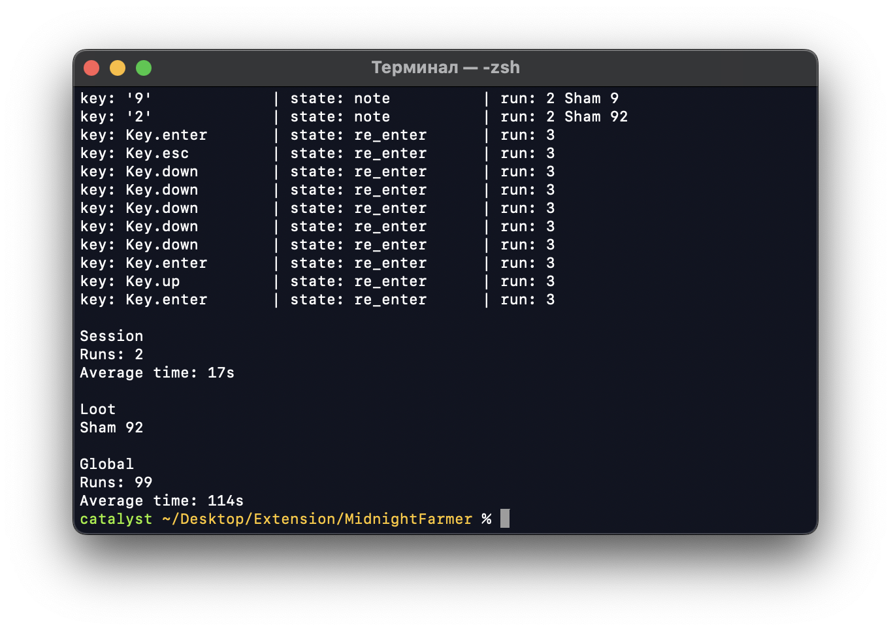

# MidnightFarmer
Script for automation and accounting of farm sessions for Borderlands 2.

Controls:  
`.` - Begin session or start a new run  
`p` - Pause   
`y` - Note  
`r_shift` - Exit  



## Setup

Script uses `pynput` to track keyboard.

```shell
pip install pynput
```

## How to use
1. Run script via terminal: `python farmer.py`. Now it begins to track your keyboard input.
2. Go into the game and at the loaded location press `.` to start run.
3. Kill this boss!
4. If run is done:  
    * If you didn't get anything, press `.` again to end this run and start a new one, the script will automatically re-enter the game.
    * If you got something, you can write about it in the game chat by pressing `y`. You can then press `enter` and the script will end this run with a note and start new run.
5. Repeat several times, starting from step 3.
6. Press `r_shift` to done script and watch statistics for this session and in general (last started run will not be saved).

All information about runs stored in `save.toml` file. You can change keybinding in `settings.toml`, and also you can change delays between pressing keys, if script does it too fast. Also you can change tag of item, that you are farming. The script will display statistics only for the tag under which the race is run.
